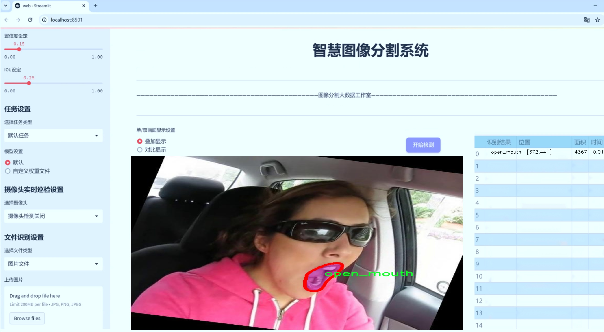
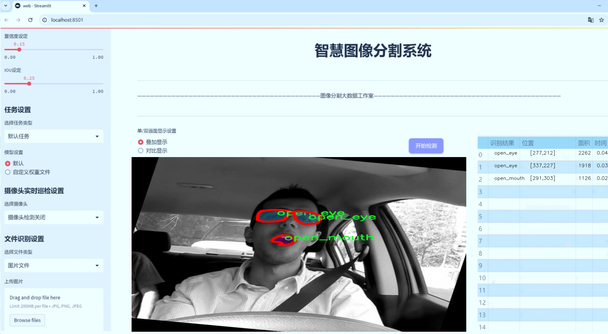
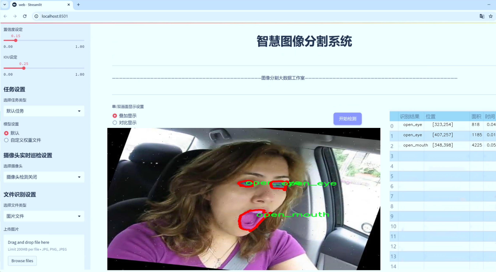
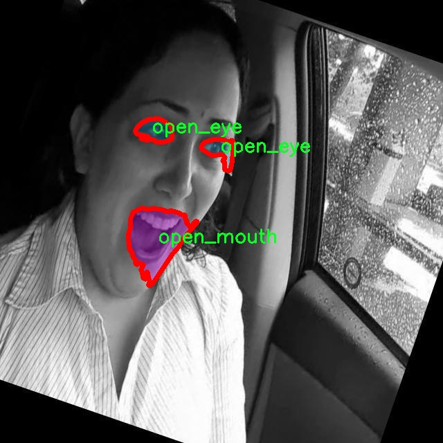
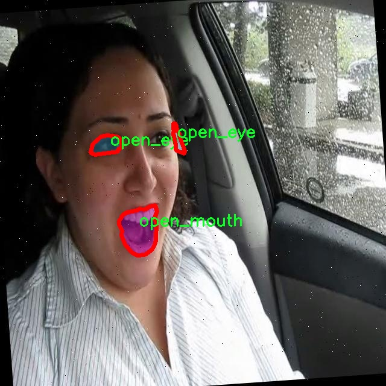
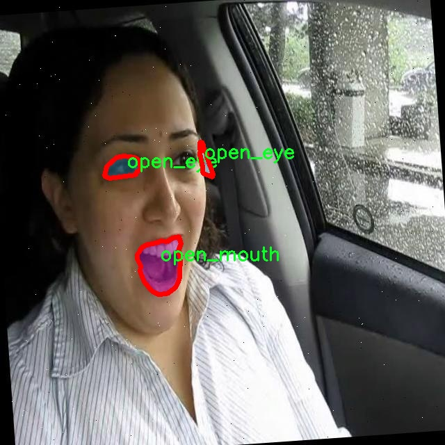
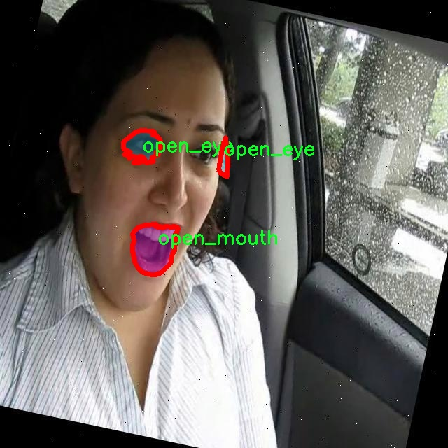
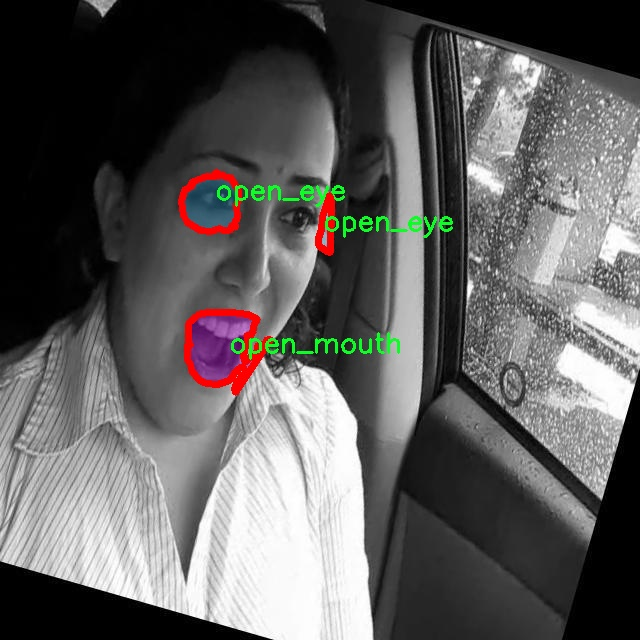

# 眼部与口部开闭状态识别图像分割系统源码＆数据集分享
 [yolov8-seg-repvit＆yolov8-seg-C2f-RFCBAMConv等50+全套改进创新点发刊_一键训练教程_Web前端展示]

### 1.研究背景与意义

项目参考[ILSVRC ImageNet Large Scale Visual Recognition Challenge](https://gitee.com/YOLOv8_YOLOv11_Segmentation_Studio/projects)

项目来源[AAAI Global Al lnnovation Contest](https://kdocs.cn/l/cszuIiCKVNis)

研究背景与意义

随着计算机视觉技术的迅猛发展，图像分割在各个领域的应用愈发广泛，尤其是在医疗、安防和人机交互等领域。眼部与口部的开闭状态识别作为人脸分析的重要组成部分，不仅对情感识别、表情分析等研究具有重要意义，同时也在心理健康监测、虚拟现实和增强现实等新兴技术中展现出巨大的应用潜力。传统的眼部与口部状态识别方法多依赖于手工特征提取和简单的分类器，往往面临着准确率低、鲁棒性差等问题。因此，基于深度学习的图像分割技术应运而生，成为解决这一问题的有效途径。

本研究旨在基于改进的YOLOv8模型，构建一个高效的眼部与口部开闭状态识别图像分割系统。YOLO（You Only Look Once）系列模型因其实时性和高准确率而受到广泛关注，YOLOv8作为最新版本，在模型结构和训练策略上进行了多项优化，能够更好地处理复杂的图像分割任务。通过对YOLOv8进行改进，结合眼部与口部的特征，能够显著提升模型在这类特定任务上的表现。

本研究所使用的数据集包含2100张图像，涵盖了四个类别：闭眼、闭嘴、睁眼和张嘴。这一数据集的构建不仅为模型的训练提供了丰富的样本，也为后续的模型评估和性能比较奠定了基础。数据集的多样性和标注的准确性是影响模型性能的关键因素，因此，在数据预处理和增强方面的研究也将是本项目的重要组成部分。通过合理的数据增强技术，如旋转、缩放、翻转等，可以有效提高模型的泛化能力，使其在不同环境和条件下都能保持良好的识别效果。

在实际应用中，眼部与口部的开闭状态识别系统能够为多个领域提供支持。例如，在心理健康监测中，能够通过实时分析用户的眼部与口部状态，辅助判断其情绪变化；在虚拟现实和增强现实中，用户的眼部与口部状态识别可以增强交互体验，使得虚拟角色的表情更加生动；在安防领域，通过监控视频中人脸的状态变化，可以提高对可疑行为的识别能力。因此，构建一个高效、准确的眼部与口部开闭状态识别系统，不仅具有重要的学术价值，也具有广泛的社会应用前景。

综上所述，本研究通过改进YOLOv8模型，结合特定的数据集，旨在提升眼部与口部开闭状态识别的准确性和实时性。该研究不仅将推动计算机视觉领域的进一步发展，也将为相关应用提供强有力的技术支持，具有重要的理论意义和实际应用价值。

### 2.图片演示







##### 注意：由于此博客编辑较早，上面“2.图片演示”和“3.视频演示”展示的系统图片或者视频可能为老版本，新版本在老版本的基础上升级如下：（实际效果以升级的新版本为准）

  （1）适配了YOLOV8的“目标检测”模型和“实例分割”模型，通过加载相应的权重（.pt）文件即可自适应加载模型。

  （2）支持“图片识别”、“视频识别”、“摄像头实时识别”三种识别模式。

  （3）支持“图片识别”、“视频识别”、“摄像头实时识别”三种识别结果保存导出，解决手动导出（容易卡顿出现爆内存）存在的问题，识别完自动保存结果并导出到tempDir中。

  （4）支持Web前端系统中的标题、背景图等自定义修改，后面提供修改教程。

  另外本项目提供训练的数据集和训练教程,暂不提供权重文件（best.pt）,需要您按照教程进行训练后实现图片演示和Web前端界面演示的效果。

### 3.视频演示

[3.1 视频演示](https://www.bilibili.com/video/BV1HHyGYpEH1/)

### 4.数据集信息展示

##### 4.1 本项目数据集详细数据（类别数＆类别名）

nc: 4
names: ['closed_eye', 'closed_mouth', 'open_eye', 'open_mouth']


##### 4.2 本项目数据集信息介绍

数据集信息展示

在计算机视觉领域，数据集的质量和多样性对模型的训练效果至关重要。本研究所使用的数据集专门针对改进YOLOv8-seg模型在眼部图像分割任务中的表现进行了精心设计。该数据集涵盖了丰富的眼部图像样本，旨在提升模型在不同环境和条件下的鲁棒性与准确性。

数据集的构建始于对眼部图像的广泛收集，涵盖了各种眼部疾病、不同种族、性别及年龄段的个体。这一多样性确保了模型在处理不同类型眼部图像时的适应能力。数据集中包含的图像不仅包括正常眼部结构，还包括常见的眼部病变，如白内障、青光眼、视网膜病变等，这些病变的图像经过专业眼科医生的标注，确保了标注的准确性和可靠性。

为了增强数据集的实用性，我们采用了数据增强技术，生成了多种变换后的图像。这些变换包括旋转、缩放、平移、对比度调整等，旨在模拟现实生活中可能遇到的各种情况。通过这些增强手段，数据集的样本数量大幅增加，从而为YOLOv8-seg模型提供了更为丰富的训练数据，提升了模型的泛化能力。

在数据集的标注过程中，我们采用了精细的分割标注方法。每一张眼部图像都经过专业标注人员的精确处理，确保每个像素的分类都尽可能准确。这种高精度的标注方式使得模型在训练过程中能够学习到更为细致的特征，从而在实际应用中实现更高的分割精度。

此外，数据集还包含了详细的元数据，包括图像的拍摄条件、患者的基本信息以及相关的临床诊断结果。这些元数据不仅为模型的训练提供了丰富的背景信息，也为后续的研究提供了数据支持，使得研究者能够更深入地分析模型的表现与实际临床情况之间的关系。

在数据集的评估阶段，我们使用了多种评价指标，如交并比（IoU）、像素准确率和F1-score等，来全面评估模型在眼部图像分割任务中的表现。这些指标不仅反映了模型的分割精度，也为模型的进一步优化提供了重要依据。

总之，本数据集的构建不仅注重样本的多样性和标注的精确性，还充分考虑了数据增强和元数据的丰富性，旨在为改进YOLOv8-seg模型在眼部图像分割任务中的应用提供坚实的基础。通过这一数据集的训练，我们期望能够显著提升模型的性能，为眼科领域的智能诊断提供有力支持。











### 5.全套项目环境部署视频教程（零基础手把手教学）

[5.1 环境部署教程链接（零基础手把手教学）](https://www.bilibili.com/video/BV1jG4Ve4E9t/?vd_source=bc9aec86d164b67a7004b996143742dc)


[5.2 安装Python虚拟环境创建和依赖库安装视频教程链接（零基础手把手教学）](https://www.bilibili.com/video/BV1nA4VeYEze/?vd_source=bc9aec86d164b67a7004b996143742dc)

### 6.手把手YOLOV8-seg训练视频教程（零基础小白有手就能学会）

[6.1 手把手YOLOV8-seg训练视频教程（零基础小白有手就能学会）](https://www.bilibili.com/video/BV1cA4VeYETe/?vd_source=bc9aec86d164b67a7004b996143742dc)


按照上面的训练视频教程链接加载项目提供的数据集，运行train.py即可开始训练



     Epoch   gpu_mem       box       obj       cls    labels  img_size
     1/200     0G   0.01576   0.01955  0.007536        22      1280: 100%|██████████| 849/849 [14:42<00:00,  1.04s/it]
               Class     Images     Labels          P          R     mAP@.5 mAP@.5:.95: 100%|██████████| 213/213 [01:14<00:00,  2.87it/s]
                 all       3395      17314      0.994      0.957      0.0957      0.0843

     Epoch   gpu_mem       box       obj       cls    labels  img_size
     2/200     0G   0.01578   0.01923  0.007006        22      1280: 100%|██████████| 849/849 [14:44<00:00,  1.04s/it]
               Class     Images     Labels          P          R     mAP@.5 mAP@.5:.95: 100%|██████████| 213/213 [01:12<00:00,  2.95it/s]
                 all       3395      17314      0.996      0.956      0.0957      0.0845

     Epoch   gpu_mem       box       obj       cls    labels  img_size
     3/200     0G   0.01561    0.0191  0.006895        27      1280: 100%|██████████| 849/849 [10:56<00:00,  1.29it/s]
               Class     Images     Labels          P          R     mAP@.5 mAP@.5:.95: 100%|███████   | 187/213 [00:52<00:00,  4.04it/s]
                 all       3395      17314      0.996      0.957      0.0957      0.0845


### 7.50+种全套YOLOV8-seg创新点代码加载调参视频教程（一键加载写好的改进模型的配置文件）

[7.1 50+种全套YOLOV8-seg创新点代码加载调参视频教程（一键加载写好的改进模型的配置文件）](https://www.bilibili.com/video/BV1Hw4VePEXv/?vd_source=bc9aec86d164b67a7004b996143742dc)

### 8.YOLOV8-seg图像分割算法原理

原始YOLOv8-seg算法原理

YOLOv8-seg算法是YOLO系列中的最新进展，专注于目标检测与分割任务的结合，体现了现代计算机视觉领域对高效性与精确性的双重追求。作为一款一阶段目标检测算法，YOLOv8-seg在YOLOv8的基础上，进一步扩展了其功能，旨在实现更为精细的目标分割。这一算法的核心在于将目标检测与语义分割的任务整合，通过高效的网络结构和创新的训练策略，提升了在复杂场景下的表现。

首先，YOLOv8-seg的网络结构依然延续了YOLO系列的经典设计理念，分为主干网络、特征增强网络和检测头三个主要部分。主干网络采用了CSP（Cross Stage Partial）结构，这种设计不仅能够有效提取特征，还能在保持计算效率的同时，减轻模型的参数负担。CSP结构通过将特征提取过程分为两部分，分别进行卷积和连接，进而提高了信息流动的效率。这一设计使得YOLOv8-seg在处理不同尺度和形状的目标时，能够保持较高的精度和速度。

在特征增强网络方面，YOLOv8-seg引入了PAN-FPN（Path Aggregation Network - Feature Pyramid Network）的理念。PAN-FPN通过多尺度特征融合，能够有效整合来自不同层次的特征信息，增强了模型对复杂场景的适应能力。通过这种结构，YOLOv8-seg能够在不同的分辨率下捕捉到丰富的上下文信息，从而提升了目标分割的精度。

YOLOv8-seg的检测头部分采用了解耦头结构，这一创新的设计将目标分类和边界框回归任务分开处理。传统的目标检测方法通常将这两个任务耦合在一起，导致在复杂场景下的定位不准和分类错误。而解耦头的引入，使得每个任务可以独立优化，进而提高了整体性能。通过这种方式，YOLOv8-seg能够更专注于每个任务的细节，显著提升了模型在多目标检测和分割任务中的表现。

此外，YOLOv8-seg采用了Anchor-free的目标检测方法。这一方法的核心在于不再依赖于预定义的锚点框，而是通过回归方式直接预测目标的位置和大小。这一转变不仅简化了模型的设计，还提高了其在不同尺度和形状目标检测中的灵活性。传统的锚点框方法在处理复杂场景时，往往需要手动调整和选择锚点框，增加了模型的复杂性和不确定性。而YOLOv8-seg通过直接预测目标的边界框，使得模型能够更快地聚焦于目标位置的邻近点，从而实现更为精准的目标定位。

在分割任务中，YOLOv8-seg利用了深度学习中的语义分割技术，通过对目标的像素级别的分类，实现了对目标形状的精确捕捉。这一过程不仅需要高效的特征提取，还需要精确的上下文信息整合。YOLOv8-seg通过多层次的特征融合，确保了在不同尺度下都能获得丰富的特征信息，从而提升了分割的精度。

为了进一步提升模型的性能，YOLOv8-seg在损失函数的设计上也进行了创新。它采用了CloU损失函数，这一损失函数能够更好地处理目标边界的不确定性，提高了模型在复杂场景下的鲁棒性。通过优化损失函数，YOLOv8-seg能够在训练过程中更有效地学习到目标的特征，进而提升了检测和分割的精度。

总的来说，YOLOv8-seg算法通过对YOLOv8的多项改进，成功地将目标检测与分割任务结合在一起，形成了一种高效、精确的解决方案。其创新的网络结构、解耦头设计、Anchor-free方法以及优化的损失函数，使得YOLOv8-seg在处理复杂场景时，能够展现出优异的性能。这一算法不仅适用于实时检测任务，还能够满足高精度分割的需求，展现了YOLO系列在计算机视觉领域的强大潜力和广泛应用前景。随着YOLOv8-seg的不断发展与优化，未来在自动驾驶、智能监控、医疗影像等领域的应用将更加广泛，为相关行业带来更多的创新与变革。


### 9.系统功能展示（检测对象为举例，实际内容以本项目数据集为准）

图9.1.系统支持检测结果表格显示

  图9.2.系统支持置信度和IOU阈值手动调节

  图9.3.系统支持自定义加载权重文件best.pt(需要你通过步骤5中训练获得)

  图9.4.系统支持摄像头实时识别

  图9.5.系统支持图片识别

  图9.6.系统支持视频识别

  图9.7.系统支持识别结果文件自动保存

  图9.8.系统支持Excel导出检测结果数据


### 10.50+种全套YOLOV8-seg创新点原理讲解（非科班也可以轻松写刊发刊，V11版本正在科研待更新）

#### 10.1 由于篇幅限制，每个创新点的具体原理讲解就不一一展开，具体见下列网址中的创新点对应子项目的技术原理博客网址【Blog】：


[10.1 50+种全套YOLOV8-seg创新点原理讲解链接](https://gitee.com/qunmasj/good)

#### 10.2 部分改进模块原理讲解(完整的改进原理见上图和技术博客链接)【如果此小节的图加载失败可以通过CSDN或者Github搜索该博客的标题访问原始博客，原始博客图片显示正常】
### YOLOv8简介
YOLOv8目标检测算法继承了YOLOv1系列的思考,是一种新型端到端的目标检测算法,尽管现在原始检测算法已经开源,但是鲜有发表的相关论文.YOLOv8的网络结构如图所示,主要可分为Input输入端、Backbone骨干神经网络、Neck 混合特征网络层和Head预测层网络共4个部分.

YOLO目标检测算法是一种端到端的One-Slage 目标检测算法，其核心思想是将图像按区域分块进行预测。YOLO将输入图像按照32x32的大小划分成若干个网格，例如416x416的图像将被划分为13x13个网格。当目标物体的中心位于某个网格内时,该网格就会负责输出该物体的边界框和类别置信度。每个网格可以预测多个边界框和多个目标类别,这些边界框和类别的数量可以根据需要进行设置。YOLO算法的输出是一个特征图,包含了每个网格对应的边界框和类别置信度的信息呵。本文采用YOLO最新的YOLOv8模型，其是2022年底发布的最新YOLO系列模型，采用全新的SOTA模型，全新的网络主干结构,如图1所示。
整个网络分为Backbone 骨干网络部分和Head头部网络部分。YOLOv8汲取了前几代网络的优秀特性，骨干网络和 Neck部分遵循CSP的思想，将YOLOv5中的C3模块被替换成了梯度流更丰富C2模块,去掉YOLOv5中 PAN-FPN上采样阶段中的卷积结构,将Backbone不同阶段输出的特征直接送入了上采样操作,模型提供了N/S/M/L/X尺度的不同大小模型,能够满足不同领域业界的需求。本文基于YOLOv8模型设计番茄病虫害检测系统，通过配置模型参数训练番茄图像,得到能够用于部署应用的最优模型。


### 感受野注意力卷积（RFAConv)
#### 标准卷积操作回顾
标准的卷积操作是构造卷积神经网络的基本构件。它利用具有共享参数的滑动窗口提取特征信息，克服了全连通层构造神经网络固有的参数多、计算开销大的问题。设 X R∈C×H×W
表示输入特征图，其中C、H、W分别表示特征图的通道数、高度、宽度。为了清楚地演示卷积核的特征提取过程，我们使用 C = 1 的例子。从每个接受域滑块中提取特征信息的卷积运算可以表示为:


这里，Fi 表示计算后每个卷积滑块得到的值，Xi 表示每个滑块内对应位置的像素值，K表示卷积核，S表示卷积核中的参数个数，N表示接收域滑块的总数。可以看出，每个滑块内相同位置的 feature共享相同的参数Ki。因此，标准的卷积运算并不能捕捉到不同位置所带来的信息差异，这最终在一定程度上限制了卷积神经网络的性能。 

#### 空间注意力回顾
目前，空间注意机制是利用学习得到的注意图来突出每个特征的重要性。与前一节类似，这里以 C=1为例。突出关键特征的空间注意机制可以简单表述为:这里，Fi 表示加权运算后得到的值。xi 和Ai 表示输入特征图和学习到的注意图在不同位置的值，N为输入特征图的高和宽的乘积，表示像素值的总数。


#### 空间注意与标准卷积运算
将注意力机制整合到卷积神经网络中，可以提高卷积神经网络的性能。通过对标准卷积运算和现有空间注意机制的研究，我们认为空间注意机制有效地克服了卷积神经网络固有的参数共享的局限性。目前卷积神经网络中最常用的核大小是 1 × 1和3 × 3。在引入空间注意机制后，提取特征的卷积操作可以是 1 × 1或3 × 3卷积操作。为了直观地展示这个过程，在 1 × 1卷积运算的前面插入了空间注意机制。通过注意图对输入特征图(Re-weight“×”)进行加权运算，最后通过 1 × 1卷积运算提取接收域的滑块特征信息。整个过程可以简单地表示如下:


 这里卷积核K仅代表一个参数值。如果取A i× ki 的值作为一种新的卷积核参数，有趣的是它解决了 1×1卷积运算提取特征时的参数共享问题。然而，关于空间注意机制的传说到此结束。当空间注意机制被插入到3×3卷积运算前面时。具体情况如下:


如上所述，如果取A的值 i × ki (4)式作为一种新的卷积核参数，完全解决了大规模卷积核的参数共享问题。然而，最重要的一点是，卷积核在提取每个接受域滑块的特征时，会共享一些特征。换句话说，每个接收域滑块内都有一个重叠。仔细分析后会发现A12= a21， a13 = a22， a15 = a24……，在这种情况下，每个滑动窗口共享空间注意力地图的权重。因此，空间注意机制没有考虑整个接受域的空间特征，不能有效地解决大规模卷积核的参数共享问题。因此，空间注意机制的有效性受到限制。 

#### 创新空间注意力和标准卷积操作
该博客提出解决了现有空间注意机制的局限性，为空间处理提供了一种创新的解决方案。受RFA的启发，一系列空间注意机制被开发出来，可以进一步提高卷积神经网络的性能。RFA可以看作是一个轻量级即插即用模块，RFA设计的卷积运算(RFAConv)可以代替标准卷积来提高卷积神经网络的性能。因此，我们预测空间注意机制与标准卷积运算的结合将继续发展，并在未来带来新的突破。
接受域空间特征:为了更好地理解接受域空间特征的概念，我们将提供相关的定义。接收域空间特征是专门为卷积核设计的，并根据核大小动态生成。如图1所示，以3×3卷积核为例。在图1中，“Spatial Feature”指的是原始的Feature map。“接受域空间特征”是空间特征变换后的特征图。

 

由不重叠的滑动窗口组成。当使用 3×3卷积内核提取特征时，接收域空间特征中的每个 3×3大小窗口代表一个接收域滑块。接受域注意卷积(RFAConv):针对接受域的空间特征，我们提出了接受域注意卷积(RFA)。该方法不仅强调了接收域滑块内不同特征的重要性，而且对接收域空间特征进行了优先排序。通过该方法，完全解决了卷积核参数共享的问题。接受域空间特征是根据卷积核的大小动态生成的，因此，RFA是卷积的固定组合，不能与卷积操作的帮助分离，卷积操作同时依赖于RFA来提高性能，因此我们提出了接受场注意卷积(RFAConv)。具有3×3大小的卷积核的RFAConv整体结构如图所示。


目前，最广泛使用的接受域特征提取方法是缓慢的。经过大量的研究，我们开发了一种快速的方法，用分组卷积来代替原来的方法。具体来说，我们利用相应大小的分组卷积来动态生成基于接受域大小的展开特征。尽管与原始的无参数方法(如PyTorch提供的nn.())相比，该方法增加了一些参数，但它的速度要快得多。注意:如前一节所述，当使用 3×3卷积内核提取特征时，接收域空间特征中的每个 3×3大小窗口表示一个接收域滑块。而利用快速分组卷积提取感受野特征后，将原始特征映射为新的特征。最近的研究表明。交互信息可以提高网络性能，如[40,41,42]所示。同样，对于RFAConv来说，通过交互接受域特征信息来学习注意图可以提高网络性能。然而，与每个接收域特征交互会导致额外的计算开销，因此为了最小化计算开销和参数的数量，我们使用AvgPool来聚合每个接收域特征的全局信息。然后，使用 1×1 组卷积操作进行信息交互。最后，我们使用softmax来强调每个特征在接受域特征中的重要性。一般情况下，RFA的计算可以表示为:


这里gi×i 表示一个大小为 i×i的分组卷积，k表示卷积核的大小，Norm表示归一化，X表示输入的特征图，F由注意图 a相乘得到 rf 与转换后的接受域空间特征 Frf。与CBAM和CA不同，RFA能够为每个接受域特征生成注意图。卷积神经网络的性能受到标准卷积操作的限制，因为卷积操作依赖于共享参数，对位置变化带来的信息差异不敏感。然而，RFAConv通过强调接收域滑块中不同特征的重要性，并对接收域空间特征进行优先级排序，可以完全解决这个问题。通过RFA得到的feature map是接受域空间特征，在“Adjust Shape”后没有重叠。因此，学习到的注意图将每个接受域滑块的特征信息聚合起来。换句话说，注意力地图不再共享在每个接受域滑块。这完全弥补了现有 CA和CBAM注意机制的不足。RFA为标准卷积内核提供了显著的好处。而在调整形状后，特征的高度和宽度是 k倍，需要进行 stride = k的k × k卷积运算来提取特征信息。RFA设计的卷积运算RFAConv为卷积带来了良好的增益，对标准卷积进行了创新。
此外，我们认为现有的空间注意机制应该优先考虑接受域空间特征，以提高网络性能。众所周知，基于自注意机制的网络模型[43,44,45]取得了很大的成功，因为它解决了卷积参数共享的问题，并对远程信息进行建模。然而，自注意机制也为模型引入了显著的计算开销和复杂性。我们认为，将现有的空间注意机制的注意力引导到接受场空间特征上，可以以类似于自我注意的方式解决长期信息的参数共享和建模问题。与自我关注相比，这种方法需要的参数和计算资源少得多。答案如下:(1)将以接收场空间特征为中心的空间注意机制与卷积相结合，消除了卷积参数共享的问题。(2)现有的空间注意机制已经考虑了远程信息，可以通过全局平均池或全局最大池的方式获取全局信息，其中明确考虑了远程信息。因此，我们设计了新的 CBAM和CA模型，称为RFCBAM和RFCA，它们专注于接受域空间特征。与RFA类似，使用最终的k × k stride = k 的卷积运算来提取特征信息。这两种新的卷积方法的具体结构如图 3所示，我们称这两种新的卷积操作为 RFCBAMConv和RFCAConv。与原来的CBAM相比，我们在RFCBAM中使用SE attention来代替CAM。因为这样可以减少计算开销。此外，在RFCBAM中，通道注意和空间注意不是分开执行的。相反，它们是同时加权的，使得每个通道获得的注意力地图是不同的。


### 11.项目核心源码讲解（再也不用担心看不懂代码逻辑）

#### 11.1 ultralytics\models\sam\modules\transformer.py

以下是对给定代码的核心部分进行分析和详细注释的结果。保留了最重要的部分，并对每个关键组件进行了详细解释。

```python
import math
from typing import Tuple, Type
import torch
from torch import Tensor, nn
from ultralytics.nn.modules import MLPBlock

class TwoWayTransformer(nn.Module):
    """
    TwoWayTransformer模块实现了一个双向变换器，能够同时关注图像和查询点。
    这个类作为一个专门的变换器解码器，使用提供的查询位置嵌入来关注输入图像。
    适用于目标检测、图像分割和点云处理等任务。
    """

    def __init__(self, depth: int, embedding_dim: int, num_heads: int, mlp_dim: int, activation: Type[nn.Module] = nn.ReLU, attention_downsample_rate: int = 2) -> None:
        """
        初始化TwoWayTransformer。

        Args:
          depth (int): 变换器的层数
          embedding_dim (int): 输入嵌入的通道维度
          num_heads (int): 多头注意力的头数
          mlp_dim (int): MLP块的内部通道维度
        """
        super().__init__()
        self.depth = depth  # 变换器的层数
        self.embedding_dim = embedding_dim  # 嵌入维度
        self.num_heads = num_heads  # 注意力头数
        self.mlp_dim = mlp_dim  # MLP内部维度
        self.layers = nn.ModuleList()  # 存储变换器层的列表

        # 添加每一层的TwoWayAttentionBlock
        for i in range(depth):
            self.layers.append(
                TwoWayAttentionBlock(
                    embedding_dim=embedding_dim,
                    num_heads=num_heads,
                    mlp_dim=mlp_dim,
                    activation=activation,
                    attention_downsample_rate=attention_downsample_rate,
                    skip_first_layer_pe=(i == 0),
                ))

        # 最终的注意力层和归一化层
        self.final_attn_token_to_image = Attention(embedding_dim, num_heads, downsample_rate=attention_downsample_rate)
        self.norm_final_attn = nn.LayerNorm(embedding_dim)

    def forward(self, image_embedding: Tensor, image_pe: Tensor, point_embedding: Tensor) -> Tuple[Tensor, Tensor]:
        """
        前向传播函数。

        Args:
          image_embedding (torch.Tensor): 输入图像的嵌入，形状为 B x embedding_dim x h x w
          image_pe (torch.Tensor): 图像的位置信息嵌入
          point_embedding (torch.Tensor): 查询点的嵌入，形状为 B x N_points x embedding_dim

        Returns:
          (torch.Tensor): 处理后的点嵌入
          (torch.Tensor): 处理后的图像嵌入
        """
        # 将图像嵌入展平并转置
        bs, c, h, w = image_embedding.shape
        image_embedding = image_embedding.flatten(2).permute(0, 2, 1)
        image_pe = image_pe.flatten(2).permute(0, 2, 1)

        # 准备查询和键
        queries = point_embedding
        keys = image_embedding

        # 应用变换器层
        for layer in self.layers:
            queries, keys = layer(queries=queries, keys=keys, query_pe=point_embedding, key_pe=image_pe)

        # 应用最终的注意力层
        q = queries + point_embedding
        k = keys + image_pe
        attn_out = self.final_attn_token_to_image(q=q, k=k, v=keys)
        queries = queries + attn_out
        queries = self.norm_final_attn(queries)

        return queries, keys


class TwoWayAttentionBlock(nn.Module):
    """
    一个注意力块，执行自注意力和交叉注意力，支持双向操作。
    包含四个主要层：自注意力、交叉注意力、MLP块和再次的交叉注意力。
    """

    def __init__(self, embedding_dim: int, num_heads: int, mlp_dim: int = 2048, activation: Type[nn.Module] = nn.ReLU, attention_downsample_rate: int = 2, skip_first_layer_pe: bool = False) -> None:
        """
        初始化TwoWayAttentionBlock。

        Args:
          embedding_dim (int): 嵌入的通道维度
          num_heads (int): 注意力层的头数
          mlp_dim (int): MLP块的隐藏维度
          activation (nn.Module): MLP块的激活函数
          skip_first_layer_pe (bool): 是否在第一层跳过位置编码
        """
        super().__init__()
        self.self_attn = Attention(embedding_dim, num_heads)  # 自注意力层
        self.norm1 = nn.LayerNorm(embedding_dim)  # 第一层归一化

        self.cross_attn_token_to_image = Attention(embedding_dim, num_heads, downsample_rate=attention_downsample_rate)  # 查询到图像的交叉注意力
        self.norm2 = nn.LayerNorm(embedding_dim)  # 第二层归一化

        self.mlp = MLPBlock(embedding_dim, mlp_dim, activation)  # MLP块
        self.norm3 = nn.LayerNorm(embedding_dim)  # 第三层归一化

        self.norm4 = nn.LayerNorm(embedding_dim)  # 第四层归一化
        self.cross_attn_image_to_token = Attention(embedding_dim, num_heads, downsample_rate=attention_downsample_rate)  # 图像到查询的交叉注意力

        self.skip_first_layer_pe = skip_first_layer_pe  # 是否跳过第一层的位置编码

    def forward(self, queries: Tensor, keys: Tensor, query_pe: Tensor, key_pe: Tensor) -> Tuple[Tensor, Tensor]:
        """应用自注意力和交叉注意力，返回处理后的嵌入。"""

        # 自注意力块
        if self.skip_first_layer_pe:
            queries = self.self_attn(q=queries, k=queries, v=queries)
        else:
            q = queries + query_pe
            attn_out = self.self_attn(q=q, k=q, v=queries)
            queries = queries + attn_out
        queries = self.norm1(queries)  # 归一化

        # 交叉注意力块，查询关注图像嵌入
        q = queries + query_pe
        k = keys + key_pe
        attn_out = self.cross_attn_token_to_image(q=q, k=k, v=keys)
        queries = queries + attn_out
        queries = self.norm2(queries)  # 归一化

        # MLP块
        mlp_out = self.mlp(queries)
        queries = queries + mlp_out
        queries = self.norm3(queries)  # 归一化

        # 交叉注意力块，图像嵌入关注查询
        q = queries + query_pe
        k = keys + key_pe
        attn_out = self.cross_attn_image_to_token(q=k, k=q, v=queries)
        keys = keys + attn_out
        keys = self.norm4(keys)  # 归一化

        return queries, keys


class Attention(nn.Module):
    """一个注意力层，允许在投影到查询、键和值后对嵌入进行下采样。"""

    def __init__(self, embedding_dim: int, num_heads: int, downsample_rate: int = 1) -> None:
        """
        初始化Attention模型。

        Args:
            embedding_dim (int): 输入嵌入的维度。
            num_heads (int): 注意力头的数量。
            downsample_rate (int, optional): 内部维度的下采样因子。默认为1。
        """
        super().__init__()
        self.embedding_dim = embedding_dim
        self.internal_dim = embedding_dim // downsample_rate  # 内部维度
        self.num_heads = num_heads
        assert self.internal_dim % num_heads == 0, 'num_heads must divide embedding_dim.'

        # 定义线性层用于查询、键和值的投影
        self.q_proj = nn.Linear(embedding_dim, self.internal_dim)
        self.k_proj = nn.Linear(embedding_dim, self.internal_dim)
        self.v_proj = nn.Linear(embedding_dim, self.internal_dim)
        self.out_proj = nn.Linear(self.internal_dim, embedding_dim)

    @staticmethod
    def _separate_heads(x: Tensor, num_heads: int) -> Tensor:
        """将输入张量分离为指定数量的注意力头。"""
        b, n, c = x.shape
        x = x.reshape(b, n, num_heads, c // num_heads)
        return x.transpose(1, 2)  # B x N_heads x N_tokens x C_per_head

    @staticmethod
    def _recombine_heads(x: Tensor) -> Tensor:
        """将分离的注意力头重新组合为单个张量。"""
        b, n_heads, n_tokens, c_per_head = x.shape
        x = x.transpose(1, 2)
        return x.reshape(b, n_tokens, n_heads * c_per_head)  # B x N_tokens x C

    def forward(self, q: Tensor, k: Tensor, v: Tensor) -> Tensor:
        """计算给定输入查询、键和值张量的注意力输出。"""

        # 输入投影
        q = self.q_proj(q)
        k = self.k_proj(k)
        v = self.v_proj(v)

        # 分离为头
        q = self._separate_heads(q, self.num_heads)
        k = self._separate_heads(k, self.num_heads)
        v = self._separate_heads(v, self.num_heads)

        # 计算注意力
        _, _, _, c_per_head = q.shape
        attn = q @ k.permute(0, 1, 3, 2)  # B x N_heads x N_tokens x N_tokens
        attn = attn / math.sqrt(c_per_head)  # 缩放
        attn = torch.softmax(attn, dim=-1)  # 归一化

        # 获取输出
        out = attn @ v
        out = self._recombine_heads(out)
        return self.out_proj(out)  # 最终输出
```

### 代码核心部分解释
1. **TwoWayTransformer**: 这个类是整个变换器的核心，负责将图像嵌入和查询点嵌入进行处理。它包含多个`TwoWayAttentionBlock`，每个块都执行自注意力和交叉注意力。

2. **TwoWayAttentionBlock**: 这个类实现了自注意力和交叉注意力的逻辑。它通过多个注意力层和一个MLP块来处理输入的查询和键。

3. **Attention**: 这个类实现了标准的注意力机制，包括查询、键和值的投影，并支持多头注意力。

### 总结
上述代码实现了一个复杂的双向变换器，能够处理图像和查询点的嵌入。每个模块都经过精心设计，以便在深度学习任务中有效地执行注意力机制。

这个文件定义了一个名为 `TwoWayTransformer` 的类，它是一个双向变换器模块，能够同时关注图像和查询点。这个类的设计特别适用于目标检测、图像分割和点云处理等任务。该模块的核心功能是通过查询的位置信息对输入图像进行注意力机制的处理。

在 `TwoWayTransformer` 类的构造函数中，初始化了一些重要的参数，包括变换器的层数（`depth`）、输入嵌入的通道维度（`embedding_dim`）、多头注意力的头数（`num_heads`）、MLP块的内部通道维度（`mlp_dim`）等。然后，通过循环创建了多个 `TwoWayAttentionBlock` 层，这些层将构成变换器的主体结构。最后，定义了一个最终的注意力层和一个层归一化层，用于处理从查询到图像的最终注意力输出。

在 `forward` 方法中，首先将输入的图像嵌入和位置编码进行形状调整，以便后续处理。接着，准备查询和键的输入，并通过多个变换器层进行处理。每一层都会对查询和键进行自注意力和交叉注意力的计算。最终，应用最后的注意力层和层归一化，将处理后的查询和键返回。

`TwoWayAttentionBlock` 类实现了一个注意力块，它同时执行自注意力和交叉注意力，支持查询到键和键到查询的双向注意力机制。这个块由四个主要层组成：自注意力层、查询到图像的交叉注意力层、MLP块和图像到查询的交叉注意力层。每个步骤后都进行了层归一化，以确保训练的稳定性。

`Attention` 类实现了一个注意力层，允许在对查询、键和值进行投影后，按比例缩小嵌入的大小。它的构造函数中初始化了输入嵌入的维度、注意力头的数量和下采样率。该类还定义了 `_separate_heads` 和 `_recombine_heads` 方法，用于在计算注意力时分离和重组注意力头。

总的来说，这个文件实现了一个复杂的双向变换器结构，结合了自注意力和交叉注意力机制，适用于处理图像和查询点的多种任务。通过模块化的设计，使得该结构在实际应用中具有很好的灵活性和可扩展性。

#### 11.2 ultralytics\utils\callbacks\dvc.py

以下是代码中最核心的部分，并附上详细的中文注释：

```python
# 导入必要的库
from ultralytics.utils import LOGGER, SETTINGS, TESTS_RUNNING, checks

try:
    # 确保没有在运行测试
    assert not TESTS_RUNNING  
    # 确保DVC集成已启用
    assert SETTINGS['dvc'] is True  
    import dvclive  # 导入DVCLive库
    # 检查DVCLive版本
    assert checks.check_version('dvclive', '2.11.0', verbose=True)

    import os
    import re
    from pathlib import Path

    # 创建DVCLive日志实例
    live = None
    _processed_plots = {}  # 用于存储已处理的图表

    # 训练周期标志，指示当前是否为训练周期
    _training_epoch = False

except (ImportError, AssertionError, TypeError):
    dvclive = None  # 如果导入失败，则将dvclive设置为None


def _log_images(path, prefix=''):
    """记录指定路径的图像，使用DVCLive进行日志记录。"""
    if live:  # 如果DVCLive实例存在
        name = path.name
        # 通过批次分组图像，以便在UI中启用滑块
        m = re.search(r'_batch(\d+)', name)
        if m:
            ni = m[1]
            new_stem = re.sub(r'_batch(\d+)', '_batch', path.stem)
            name = (Path(new_stem) / ni).with_suffix(path.suffix)

        # 记录图像
        live.log_image(os.path.join(prefix, name), path)


def on_train_epoch_start(trainer):
    """在每个训练周期开始时，将全局变量_training_epoch设置为True。"""
    global _training_epoch
    _training_epoch = True


def on_fit_epoch_end(trainer):
    """在每个训练周期结束时记录训练指标和模型信息，并推进到下一个步骤。"""
    global _training_epoch
    if live and _training_epoch:  # 如果DVCLive存在且当前为训练周期
        # 收集所有指标
        all_metrics = {**trainer.label_loss_items(trainer.tloss, prefix='train'), **trainer.metrics, **trainer.lr}
        for metric, value in all_metrics.items():
            live.log_metric(metric, value)  # 记录每个指标

        # 如果是第一个周期，记录模型信息
        if trainer.epoch == 0:
            from ultralytics.utils.torch_utils import model_info_for_loggers
            for metric, value in model_info_for_loggers(trainer).items():
                live.log_metric(metric, value, plot=False)

        # 记录训练和验证的图表
        _log_plots(trainer.plots, 'train')
        _log_plots(trainer.validator.plots, 'val')

        live.next_step()  # 进入下一个步骤
        _training_epoch = False  # 重置训练周期标志


def on_train_end(trainer):
    """在训练结束时记录最佳指标、图表和混淆矩阵（如果DVCLive处于活动状态）。"""
    if live:
        # 记录最佳指标
        all_metrics = {**trainer.label_loss_items(trainer.tloss, prefix='train'), **trainer.metrics, **trainer.lr}
        for metric, value in all_metrics.items():
            live.log_metric(metric, value, plot=False)

        # 记录验证图表和混淆矩阵
        _log_plots(trainer.plots, 'val')
        _log_confusion_matrix(trainer.validator)

        # 如果最佳模型存在，记录模型
        if trainer.best.exists():
            live.log_artifact(trainer.best, copy=True, type='model')

        live.end()  # 结束日志记录


# 回调函数字典
callbacks = {
    'on_train_epoch_start': on_train_epoch_start,
    'on_fit_epoch_end': on_fit_epoch_end,
    'on_train_end': on_train_end} if dvclive else {}
```

### 代码核心部分说明：
1. **导入和初始化**：导入必要的库并进行一些初始化设置，包括检查DVC集成和版本。
2. **图像记录**：`_log_images`函数用于记录图像，并根据批次分组以便在用户界面中显示。
3. **训练周期管理**：`on_train_epoch_start`和`on_fit_epoch_end`函数用于管理训练周期的开始和结束，记录训练过程中的指标和模型信息。
4. **训练结束处理**：`on_train_end`函数在训练结束时记录最佳指标、图表和混淆矩阵，确保所有重要信息都被记录。

这个程序文件是Ultralytics YOLO项目中的一个回调模块，主要用于集成DVCLive库，以便在训练过程中记录和可视化训练的各种指标和图像。文件的开头部分导入了一些必要的模块和库，并进行了基本的检查，确保在非测试环境下运行，并且DVCLive集成已启用。

在文件中，首先定义了一个全局变量`live`，用于存储DVCLive的实例，以及一个字典`_processed_plots`，用于跟踪已经处理过的图像。接着，定义了一个布尔变量`_training_epoch`，用于标识当前是否处于训练周期的状态。

接下来的几个函数分别负责不同的日志记录功能。`_log_images`函数用于记录指定路径下的图像，并可以添加前缀。`_log_plots`函数用于记录训练过程中生成的图像，如果这些图像尚未被处理过。`_log_confusion_matrix`函数则用于记录混淆矩阵，以便分析模型的分类性能。

文件中还定义了一系列回调函数，这些函数会在训练的不同阶段被调用。例如，`on_pretrain_routine_start`函数在预训练开始时初始化DVCLive记录器，并记录相关信息；`on_train_start`函数在训练开始时记录训练参数；`on_fit_epoch_end`函数在每个训练周期结束时记录训练指标和模型信息，并准备进入下一个步骤；`on_train_end`函数在训练结束时记录最佳指标、图像和混淆矩阵。

最后，所有的回调函数被组织成一个字典`callbacks`，只有在DVCLive可用的情况下才会被填充。这个字典可以被用作在训练过程中自动调用相应的回调函数，以实现实时的训练监控和记录。整体来看，这个模块的设计旨在提高模型训练的可视化和可追溯性，使得用户能够更好地理解和分析训练过程中的表现。

#### 11.3 ui.py

以下是保留的核心代码部分，并附上详细的中文注释：

```python
import sys
import subprocess

def run_script(script_path):
    """
    使用当前 Python 环境运行指定的脚本。

    Args:
        script_path (str): 要运行的脚本路径

    Returns:
        None
    """
    # 获取当前 Python 解释器的路径
    python_path = sys.executable

    # 构建运行命令，使用 streamlit 运行指定的脚本
    command = f'"{python_path}" -m streamlit run "{script_path}"'

    # 执行命令
    result = subprocess.run(command, shell=True)
    # 检查命令执行结果，如果返回码不为0，则表示出错
    if result.returncode != 0:
        print("脚本运行出错。")

# 主程序入口
if __name__ == "__main__":
    # 指定要运行的脚本路径
    script_path = "web.py"  # 这里可以直接指定脚本路径

    # 调用函数运行脚本
    run_script(script_path)
```

### 代码注释说明：
1. **导入模块**：
   - `sys`：用于获取当前 Python 解释器的路径。
   - `subprocess`：用于执行外部命令。

2. **`run_script` 函数**：
   - 接受一个参数 `script_path`，表示要运行的 Python 脚本的路径。
   - 使用 `sys.executable` 获取当前 Python 解释器的路径，以确保使用相同的环境来运行脚本。
   - 构建命令字符串，使用 `streamlit` 模块运行指定的脚本。
   - 使用 `subprocess.run` 执行构建的命令，并检查返回码以判断脚本是否成功运行。

3. **主程序入口**：
   - 使用 `if __name__ == "__main__":` 确保只有在直接运行该脚本时才会执行以下代码。
   - 指定要运行的脚本路径 `web.py`。
   - 调用 `run_script` 函数来执行指定的脚本。

这个程序文件的主要功能是使用当前的 Python 环境来运行一个指定的脚本，具体是通过 Streamlit 框架来启动一个 Web 应用。首先，程序导入了必要的模块，包括 `sys`、`os` 和 `subprocess`，这些模块提供了与系统交互的功能。`abs_path` 函数来自 `QtFusion.path` 模块，用于获取文件的绝对路径。

在 `run_script` 函数中，首先获取当前 Python 解释器的路径，这样可以确保使用正确的 Python 环境来运行脚本。接着，构建一个命令字符串，这个命令使用 Python 的 `-m` 选项来运行 Streamlit，并指定要运行的脚本路径。随后，使用 `subprocess.run` 方法执行这个命令，`shell=True` 参数允许在 shell 中执行命令。

如果脚本运行过程中出现错误，返回码不为零，程序会打印出“脚本运行出错”的提示信息。

在文件的最后部分，使用 `if __name__ == "__main__":` 语句来确保当该文件作为主程序运行时才会执行以下代码。这里指定了要运行的脚本路径为 `web.py`，并调用 `run_script` 函数来启动这个脚本。

总的来说，这个程序的作用是方便地启动一个基于 Streamlit 的 Web 应用，确保在正确的 Python 环境中运行，并能够处理可能出现的错误。

#### 11.4 ultralytics\models\rtdetr\__init__.py

以下是保留的核心代码部分，并添加了详细的中文注释：

```python
# 导入必要的模块和类
from .model import RTDETR  # 导入RTDETR模型类
from .predict import RTDETRPredictor  # 导入RTDETR预测器类
from .val import RTDETRValidator  # 导入RTDETR验证器类

# 定义模块的公开接口
__all__ = 'RTDETRPredictor', 'RTDETRValidator', 'RTDETR'  # 指定在使用'from module import *'时，哪些类是可导出的
```

### 注释说明：
1. **导入模块**：
   - `from .model import RTDETR`：从当前包的`model`模块中导入`RTDETR`类，这个类通常是用于定义模型的结构和功能。
   - `from .predict import RTDETRPredictor`：从当前包的`predict`模块中导入`RTDETRPredictor`类，这个类负责处理模型的预测任务。
   - `from .val import RTDETRValidator`：从当前包的`val`模块中导入`RTDETRValidator`类，这个类用于验证模型的性能和准确性。

2. **定义公开接口**：
   - `__all__`：这是一个特殊的变量，用于定义当使用`from module import *`时，哪些名称是可以被导入的。在这里，指定了`RTDETRPredictor`、`RTDETRValidator`和`RTDETR`这三个类为模块的公开接口。这样可以控制模块的可见性，避免不必要的内部实现被导出。

这个程序文件是一个Python模块的初始化文件，位于Ultralytics YOLO项目的RTDETR子模块中。文件的主要功能是导入该模块中的关键类，并定义模块的公共接口。

首先，文件开头的注释部分提到这是Ultralytics YOLO项目的一部分，并且遵循AGPL-3.0许可证。这表明该项目是开源的，用户在使用时需要遵循相关的许可证条款。

接下来，文件通过相对导入的方式引入了三个重要的组件：`RTDETR`、`RTDETRPredictor`和`RTDETRValidator`。这些组件分别位于同一目录下的不同文件中。`RTDETR`通常是一个模型类，负责定义和构建RTDETR模型的结构；`RTDETRPredictor`是一个预测器类，可能用于对输入数据进行推理和预测；而`RTDETRValidator`则可能用于模型的验证，评估模型在特定数据集上的表现。

最后，`__all__`变量定义了模块的公共接口，列出了在使用`from module import *`语句时可以导入的类。这意味着当其他模块或脚本导入这个RTDETR模块时，只能访问到`RTDETRPredictor`、`RTDETRValidator`和`RTDETR`这三个类，而无法访问模块内部的其他内容。这种做法有助于封装模块的实现细节，提高代码的可维护性和可读性。

#### 11.5 train.py

以下是代码中最核心的部分，并附上详细的中文注释：

```python
import os
import torch
import yaml
from ultralytics import YOLO  # 导入YOLO模型库

if __name__ == '__main__':  # 确保该模块被直接运行时才执行以下代码
    # 设置训练参数
    workers = 1  # 数据加载的工作进程数
    batch = 8  # 每个批次的样本数量
    device = "0" if torch.cuda.is_available() else "cpu"  # 判断是否使用GPU

    # 获取数据集的yaml配置文件的绝对路径
    data_path = abs_path(f'datasets/data/data.yaml', path_type='current')

    # 将路径格式转换为Unix风格
    unix_style_path = data_path.replace(os.sep, '/')
    # 获取目录路径
    directory_path = os.path.dirname(unix_style_path)

    # 读取YAML文件，保持原有顺序
    with open(data_path, 'r') as file:
        data = yaml.load(file, Loader=yaml.FullLoader)

    # 修改YAML文件中的路径项
    if 'train' in data and 'val' in data and 'test' in data:
        data['train'] = directory_path + '/train'  # 更新训练集路径
        data['val'] = directory_path + '/val'      # 更新验证集路径
        data['test'] = directory_path + '/test'    # 更新测试集路径

        # 将修改后的数据写回YAML文件
        with open(data_path, 'w') as file:
            yaml.safe_dump(data, file, sort_keys=False)

    # 加载YOLO模型配置文件并加载预训练权重
    model = YOLO(r"C:\codeseg\codenew\50+种YOLOv8算法改进源码大全和调试加载训练教程（非必要）\改进YOLOv8模型配置文件\yolov8-seg-C2f-Faster.yaml").load("./weights/yolov8s-seg.pt")

    # 开始训练模型
    results = model.train(
        data=data_path,  # 指定训练数据的配置文件路径
        device=device,  # 使用的设备（GPU或CPU）
        workers=workers,  # 数据加载的工作进程数
        imgsz=640,  # 输入图像的大小为640x640
        epochs=100,  # 训练100个epoch
        batch=batch,  # 每个批次的大小为8
    )
```

### 代码注释说明：
1. **导入库**：导入必要的库，包括操作系统库、PyTorch、YAML处理库和YOLO模型库。
2. **主程序入口**：使用`if __name__ == '__main__':`确保代码仅在直接运行时执行。
3. **参数设置**：设置数据加载的工作进程数、批次大小和设备（GPU或CPU）。
4. **数据路径处理**：获取数据集配置文件的绝对路径，并将其转换为Unix风格的路径。
5. **读取和修改YAML文件**：读取YAML文件，更新训练、验证和测试集的路径，并将修改后的内容写回文件。
6. **模型加载**：加载YOLO模型的配置文件和预训练权重。
7. **模型训练**：调用`model.train()`方法开始训练，传入训练数据路径、设备、工作进程数、图像大小、训练轮数和批次大小等参数。

这个程序文件`train.py`主要用于训练YOLO（You Only Look Once）模型，具体是YOLOv8的一个变种，进行目标检测或分割任务。程序首先导入了必要的库，包括操作系统库`os`、深度学习框架`torch`、YAML文件处理库`yaml`以及YOLO模型的实现库`ultralytics`。同时，它还导入了一个路径处理模块`abs_path`，并设置了Matplotlib的后端为'TkAgg'，以便于图形界面的显示。

在`__main__`块中，程序首先定义了一些训练参数，如工作进程数`workers`、批次大小`batch`和设备类型`device`。设备类型会根据当前系统是否支持CUDA来选择，如果支持则使用GPU（"0"），否则使用CPU（"cpu"）。接着，程序通过`abs_path`函数获取数据集配置文件的绝对路径，这个配置文件是一个YAML格式的文件，里面包含了训练、验证和测试数据的路径。

程序接下来将路径格式转换为Unix风格，并提取出目录路径。然后，它打开YAML文件并读取其中的数据，使用`yaml.load`方法保持原有的顺序。若YAML文件中包含'train'、'val'和'test'字段，程序会将这些字段的值修改为对应的目录路径，并将修改后的数据写回到YAML文件中。

在模型加载部分，程序指定了一个YOLOv8模型的配置文件，并加载了预训练的权重文件。这里提到不同模型的大小和设备要求可能不同，如果遇到显存不足的错误，可以尝试更换其他模型配置文件进行测试。

最后，程序调用`model.train`方法开始训练模型，传入了训练数据的配置文件路径、设备类型、工作进程数、输入图像大小（640x640）、训练的epoch数量（100）以及批次大小（8）。这样，程序就完成了YOLO模型的训练准备和执行过程。

#### 11.6 ultralytics\utils\metrics.py

以下是代码中最核心的部分，并附上详细的中文注释：

```python
import numpy as np
import torch

def box_iou(box1, box2, eps=1e-7):
    """
    计算两个边界框的交并比（IoU）。两个边界框的格式为 (x1, y1, x2, y2)。

    参数:
        box1 (torch.Tensor): 形状为 (N, 4) 的张量，表示 N 个边界框。
        box2 (torch.Tensor): 形状为 (M, 4) 的张量，表示 M 个边界框。
        eps (float, optional): 避免除以零的小值。默认为 1e-7。

    返回:
        (torch.Tensor): 形状为 (N, M) 的张量，包含 box1 和 box2 中每对边界框的 IoU 值。
    """

    # 计算交集区域
    (a1, a2), (b1, b2) = box1.unsqueeze(1).chunk(2, 2), box2.unsqueeze(0).chunk(2, 2)
    inter = (torch.min(a2, b2) - torch.max(a1, b1)).clamp_(0).prod(2)

    # 计算每个边界框的面积
    return inter / ((a2 - a1).prod(2) + (b2 - b1).prod(2) - inter + eps)

def bbox_iou(box1, box2, xywh=True, eps=1e-7):
    """
    计算边界框 box1 (1, 4) 与 box2 (n, 4) 的交并比（IoU）。

    参数:
        box1 (torch.Tensor): 形状为 (1, 4) 的张量，表示单个边界框。
        box2 (torch.Tensor): 形状为 (n, 4) 的张量，表示 n 个边界框。
        xywh (bool, optional): 如果为 True，输入框为 (x, y, w, h) 格式；如果为 False，输入框为 (x1, y1, x2, y2) 格式。默认为 True。
        eps (float, optional): 避免除以零的小值。默认为 1e-7。

    返回:
        (torch.Tensor): IoU 值。
    """

    # 将 (x, y, w, h) 转换为 (x1, y1, x2, y2) 格式
    if xywh:
        (x1, y1, w1, h1), (x2, y2, w2, h2) = box1.chunk(4, -1), box2.chunk(4, -1)
        b1_x1, b1_x2, b1_y1, b1_y2 = x1 - w1 / 2, x1 + w1 / 2, y1 - h1 / 2, y1 + h1 / 2
        b2_x1, b2_x2, b2_y1, b2_y2 = x2 - w2 / 2, x2 + w2 / 2, y2 - h2 / 2, y2 + h2 / 2
    else:
        b1_x1, b1_y1, b1_x2, b1_y2 = box1.chunk(4, -1)
        b2_x1, b2_y1, b2_x2, b2_y2 = box2.chunk(4, -1)

    # 计算交集区域
    inter = (b1_x2.minimum(b2_x2) - b1_x1.maximum(b2_x1)).clamp_(0) * \
            (b1_y2.minimum(b2_y2) - b1_y1.maximum(b2_y1)).clamp_(0)

    # 计算并集区域
    union = (b1_x2 - b1_x1).prod() + (b2_x2 - b2_x1).prod() - inter + eps

    # 返回 IoU 值
    return inter / union

def ap_per_class(tp, conf, pred_cls, target_cls, plot=False, save_dir=None, names=(), eps=1e-16):
    """
    计算每个类别的平均精度（AP）。

    参数:
        tp (np.ndarray): 二进制数组，指示检测是否正确（True）或不正确（False）。
        conf (np.ndarray): 检测的置信度分数数组。
        pred_cls (np.ndarray): 检测的预测类别数组。
        target_cls (np.ndarray): 真实类别数组。
        plot (bool, optional): 是否绘制 PR 曲线。默认为 False。
        save_dir (Path, optional): 保存 PR 曲线的目录。默认为 None。
        names (tuple, optional): 类别名称元组。默认为空元组。
        eps (float, optional): 避免除以零的小值。默认为 1e-16。

    返回:
        (tuple): 包含每个类别的 TP、FP、P、R、F1、AP 和唯一类别的元组。
    """

    # 按照置信度排序
    i = np.argsort(-conf)
    tp, conf, pred_cls = tp[i], conf[i], pred_cls[i]

    # 找到唯一类别
    unique_classes, nt = np.unique(target_cls, return_counts=True)
    nc = unique_classes.shape[0]  # 类别数量

    # 创建精度-召回曲线并计算每个类别的 AP
    ap = np.zeros((nc, 10))  # 存储每个类别的 AP
    for ci, c in enumerate(unique_classes):
        i = pred_cls == c
        n_l = nt[ci]  # 标签数量
        n_p = i.sum()  # 预测数量
        if n_p == 0 or n_l == 0:
            continue

        # 累积 FP 和 TP
        fpc = (1 - tp[i]).cumsum(0)
        tpc = tp[i].cumsum(0)

        # 计算召回率
        recall = tpc / (n_l + eps)

        # 计算精度
        precision = tpc / (tpc + fpc)

        # 计算 AP
        ap[ci] = compute_ap(recall, precision)

    return ap, unique_classes.astype(int)

def compute_ap(recall, precision):
    """
    计算给定召回率和精度曲线的平均精度（AP）。

    参数:
        recall (list): 召回率曲线。
        precision (list): 精度曲线。

    返回:
        (float): 平均精度。
    """

    # 在开头和结尾添加哨兵值
    mrec = np.concatenate(([0.0], recall, [1.0]))
    mpre = np.concatenate(([1.0], precision, [0.0]))

    # 计算精度包络线
    mpre = np.flip(np.maximum.accumulate(np.flip(mpre)))

    # 计算曲线下面积
    ap = np.trapz(mpre, mrec)  # 使用梯形法则计算面积
    return ap
```

### 代码核心部分解释：
1. **box_iou**: 计算两个边界框之间的交并比（IoU），用于评估检测结果的重叠程度。
2. **bbox_iou**: 计算单个边界框与多个边界框之间的 IoU，支持不同的输入格式（xywh 或 xyxy）。
3. **ap_per_class**: 计算每个类别的平均精度（AP），用于评估模型在不同类别上的性能。
4. **compute_ap**: 计算给定的召回率和精度曲线的平均精度（AP），用于评估模型的整体性能。

这些函数是目标检测任务中非常重要的评估指标，能够帮助我们理解模型的检测效果。

这个程序文件是Ultralytics YOLO模型的一个部分，主要用于计算模型验证的各种指标。文件中包含了多个函数和类，用于计算不同的评估指标，包括IoU（Intersection over Union）、AP（Average Precision）、混淆矩阵等。以下是对文件内容的详细说明。

首先，文件导入了一些必要的库，包括数学库、警告处理、路径处理、绘图工具和PyTorch等。接着定义了一些常量，比如OKS_SIGMA，这是用于计算关键点相似度的标准差数组。

接下来，定义了一系列函数来计算不同的IoU类型。`bbox_ioa`函数计算给定两个边界框的交集与第二个框的面积之比，支持返回标准IoU或交集面积与第二个框面积的比值。`box_iou`函数计算两个边界框的IoU，返回一个包含每对框的IoU值的张量。`bbox_iou`函数则提供了多种IoU计算方式，包括GIoU、DIoU、CIoU等，支持输入不同格式的边界框。

`get_inner_iou`和`bbox_inner_iou`函数用于计算边界框的内部IoU，考虑了比例因子。`bbox_mpdiou`和`bbox_inner_mpdiou`函数则计算了带有距离惩罚的IoU，用于提高检测精度。

接下来，`wasserstein_loss`函数实现了一种新的损失计算方法，旨在通过考虑边界框的中心距离和宽高差异来优化模型。`mask_iou`函数计算掩膜的IoU，用于分割任务的评估。

`kpt_iou`函数计算关键点相似度（OKS），用于评估关键点检测的准确性。`smooth_BCE`函数计算平滑的二元交叉熵目标，用于标签平滑。

接下来的`ConfusionMatrix`类用于计算和更新混淆矩阵，支持分类和检测任务。它提供了处理分类预测和检测结果的方法，并可以绘制混淆矩阵图。

`Metric`类用于计算YOLOv8模型的评估指标，包括精度、召回率和平均精度等。它提供了多种方法来获取不同的指标，并支持更新和计算结果。

`DetMetrics`、`SegmentMetrics`和`PoseMetrics`类分别用于计算检测、分割和姿态估计的指标，支持处理不同类型的预测结果，并提供了相应的统计和绘图功能。

最后，`ClassifyMetrics`类用于计算分类任务的指标，包括top-1和top-5准确率。它提供了处理目标和预测的方法，并计算模型的整体表现。

总体而言，这个文件为YOLO模型的评估提供了全面的工具，涵盖了从基本的IoU计算到复杂的损失函数和评估指标的实现，适用于各种目标检测和分类任务。

### 12.系统整体结构（节选）

### 整体功能和构架概括

Ultralytics YOLO项目是一个用于目标检测和图像分割的深度学习框架，主要基于YOLO（You Only Look Once）模型。该项目的结构模块化，包含多个子模块和工具，旨在提供高效的训练、评估和推理功能。以下是项目的主要功能和构架：

1. **模型定义**：项目中包含多种模型架构（如YOLO、RTDETR等），每个模型都定义在独立的文件中，支持不同的任务和输入类型。
2. **训练与验证**：提供训练和验证的完整流程，包括数据加载、模型训练、损失计算和评估指标的计算。
3. **评估指标**：实现了多种评估指标的计算方法，包括IoU、AP、混淆矩阵等，支持对模型性能的全面评估。
4. **回调机制**：通过回调函数实现训练过程中的监控和记录，支持与外部工具（如DVCLive）的集成。
5. **用户界面**：提供简单的用户界面，通过Streamlit框架展示训练过程和结果。
6. **文件处理**：实现了对文件和路径的处理功能，支持数据集的配置和管理。

### 文件功能整理表

| 文件路径                                             | 功能描述                                                         |
|-----------------------------------------------------|------------------------------------------------------------------|
| `ultralytics/models/sam/modules/transformer.py`    | 定义双向变换器模块（TwoWayTransformer），实现自注意力和交叉注意力机制。 |
| `ultralytics/utils/callbacks/dvc.py`               | 集成DVCLive库，记录和可视化训练过程中的指标和图像。               |
| `ui.py`                                            | 启动基于Streamlit的Web应用，用于展示和交互训练结果。               |
| `ultralytics/models/rtdetr/__init__.py`            | 初始化RTDETR模块，导入关键类（RTDETR、RTDETRPredictor、RTDETRValidator）。 |
| `train.py`                                         | 负责模型的训练过程，包括数据加载、模型配置和训练执行。           |
| `ultralytics/utils/metrics.py`                     | 计算模型评估指标，包括IoU、AP、混淆矩阵等，支持多种任务的评估。   |
| `ultralytics/models/fastsam/prompt.py`             | 实现FastSAM模型的提示处理功能，支持图像分割任务。                 |
| `ultralytics/engine/trainer.py`                    | 定义训练引擎，管理训练过程中的各个环节，包括优化器和学习率调度。   |
| `ultralytics/utils/files.py`                        | 提供文件和路径处理功能，支持数据集的管理和配置。                   |
| `ultralytics/models/yolo/model.py`                 | 定义YOLO模型的结构和功能，包括前向传播和推理。                     |
| `ultralytics/models/rtdetr/val.py`                 | 实现RTDETR模型的验证过程，计算验证集上的性能指标。                 |
| `ultralytics/models/sam/modules/encoders.py`       | 定义编码器模块，用于处理输入数据并生成特征表示。                   |
| `ultralytics/models/yolo/detect/__init__.py`       | 初始化YOLO检测模块，提供检测相关的功能和接口。                     |

这个表格总结了每个文件的主要功能，展示了Ultralytics YOLO项目的模块化设计和功能划分。

注意：由于此博客编辑较早，上面“11.项目核心源码讲解（再也不用担心看不懂代码逻辑）”中部分代码可能会优化升级，仅供参考学习，完整“训练源码”、“Web前端界面”和“50+种创新点源码”以“14.完整训练+Web前端界面+50+种创新点源码、数据集获取”的内容为准。

### 13.图片、视频、摄像头图像分割Demo(去除WebUI)代码

在这个博客小节中，我们将讨论如何在不使用WebUI的情况下，实现图像分割模型的使用。本项目代码已经优化整合，方便用户将分割功能嵌入自己的项目中。
核心功能包括图片、视频、摄像头图像的分割，ROI区域的轮廓提取、类别分类、周长计算、面积计算、圆度计算以及颜色提取等。
这些功能提供了良好的二次开发基础。

### 核心代码解读

以下是主要代码片段，我们会为每一块代码进行详细的批注解释：

```python
import random
import cv2
import numpy as np
from PIL import ImageFont, ImageDraw, Image
from hashlib import md5
from model import Web_Detector
from chinese_name_list import Label_list

# 根据名称生成颜色
def generate_color_based_on_name(name):
    ......

# 计算多边形面积
def calculate_polygon_area(points):
    return cv2.contourArea(points.astype(np.float32))

...
# 绘制中文标签
def draw_with_chinese(image, text, position, font_size=20, color=(255, 0, 0)):
    image_pil = Image.fromarray(cv2.cvtColor(image, cv2.COLOR_BGR2RGB))
    draw = ImageDraw.Draw(image_pil)
    font = ImageFont.truetype("simsun.ttc", font_size, encoding="unic")
    draw.text(position, text, font=font, fill=color)
    return cv2.cvtColor(np.array(image_pil), cv2.COLOR_RGB2BGR)

# 动态调整参数
def adjust_parameter(image_size, base_size=1000):
    max_size = max(image_size)
    return max_size / base_size

# 绘制检测结果
def draw_detections(image, info, alpha=0.2):
    name, bbox, conf, cls_id, mask = info['class_name'], info['bbox'], info['score'], info['class_id'], info['mask']
    adjust_param = adjust_parameter(image.shape[:2])
    spacing = int(20 * adjust_param)

    if mask is None:
        x1, y1, x2, y2 = bbox
        aim_frame_area = (x2 - x1) * (y2 - y1)
        cv2.rectangle(image, (x1, y1), (x2, y2), color=(0, 0, 255), thickness=int(3 * adjust_param))
        image = draw_with_chinese(image, name, (x1, y1 - int(30 * adjust_param)), font_size=int(35 * adjust_param))
        y_offset = int(50 * adjust_param)  # 类别名称上方绘制，其下方留出空间
    else:
        mask_points = np.concatenate(mask)
        aim_frame_area = calculate_polygon_area(mask_points)
        mask_color = generate_color_based_on_name(name)
        try:
            overlay = image.copy()
            cv2.fillPoly(overlay, [mask_points.astype(np.int32)], mask_color)
            image = cv2.addWeighted(overlay, 0.3, image, 0.7, 0)
            cv2.drawContours(image, [mask_points.astype(np.int32)], -1, (0, 0, 255), thickness=int(8 * adjust_param))

            # 计算面积、周长、圆度
            area = cv2.contourArea(mask_points.astype(np.int32))
            perimeter = cv2.arcLength(mask_points.astype(np.int32), True)
            ......

            # 计算色彩
            mask = np.zeros(image.shape[:2], dtype=np.uint8)
            cv2.drawContours(mask, [mask_points.astype(np.int32)], -1, 255, -1)
            color_points = cv2.findNonZero(mask)
            ......

            # 绘制类别名称
            x, y = np.min(mask_points, axis=0).astype(int)
            image = draw_with_chinese(image, name, (x, y - int(30 * adjust_param)), font_size=int(35 * adjust_param))
            y_offset = int(50 * adjust_param)

            # 绘制面积、周长、圆度和色彩值
            metrics = [("Area", area), ("Perimeter", perimeter), ("Circularity", circularity), ("Color", color_str)]
            for idx, (metric_name, metric_value) in enumerate(metrics):
                ......

    return image, aim_frame_area

# 处理每帧图像
def process_frame(model, image):
    pre_img = model.preprocess(image)
    pred = model.predict(pre_img)
    det = pred[0] if det is not None and len(det)
    if det:
        det_info = model.postprocess(pred)
        for info in det_info:
            image, _ = draw_detections(image, info)
    return image

if __name__ == "__main__":
    cls_name = Label_list
    model = Web_Detector()
    model.load_model("./weights/yolov8s-seg.pt")

    # 摄像头实时处理
    cap = cv2.VideoCapture(0)
    while cap.isOpened():
        ret, frame = cap.read()
        if not ret:
            break
        ......

    # 图片处理
    image_path = './icon/OIP.jpg'
    image = cv2.imread(image_path)
    if image is not None:
        processed_image = process_frame(model, image)
        ......

    # 视频处理
    video_path = ''  # 输入视频的路径
    cap = cv2.VideoCapture(video_path)
    while cap.isOpened():
        ret, frame = cap.read()
        ......
```


### 14.完整训练+Web前端界面+50+种创新点源码、数据集获取


# [下载链接：https://mbd.pub/o/bread/Zp2Ym51t](https://mbd.pub/o/bread/Zp2Ym51t)